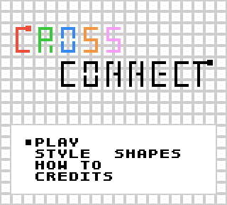
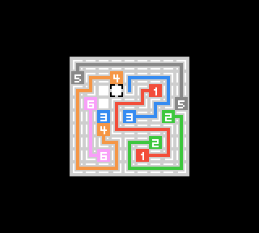
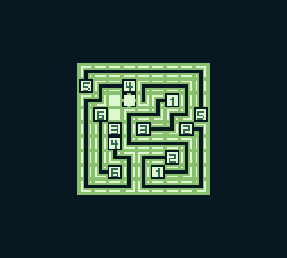

# CrossConnect
  
A puzzle game for the Game Boy based on the classic game "[Numberlink](https://en.wikipedia.org/wiki/Numberlink)".  
Written in a mixture of C and ASM using [GBSDK](https://github.com/daid/gbsdk).  
Intended for the Game Boy Color, but is also playable on the regular Game Boy!  

## How to Play
Each puzzle is a square grid, containing several pairs of nodes sharing the same colour / number / shape. Your goal is to draw lines so that:

1. Every node is connected to its pair.  
2. The entire board is filled with lines.

You can move the cursor using the D-pad. To draw lines, move the cursor over a node or the end of a line, hold A, then move the cursor again.  
Use the B button to delete lines. If a line segment isn't connected to any node, it will be automatically deleted.

If a level has you totally stumped, or you're just a dirty little cheater, all level solutions can be found in the `levelgen/levels/` folder. Don't worry, I won't judge you. Probably.

Tip: In the level select menu, you can hold Select to switch pages faster.

## Building
First, follow the [GBSDK install instructions](https://daid.github.io/gbsdk/setup/installation.html). This project expects RGBDS 0.5.2 and SDCC 4.2.0.  
After that, you can just run `make` in the base directory. The ROM is generated as `CrossConnect.gbc`.

## Credits
- Puzzles were generated using Thomas Ahle's [Numberlink](https://github.com/thomasahle/numberlink).
- [WitchFont8](https://lavenfurr.itch.io/witchfont8) by Lavenfurr
